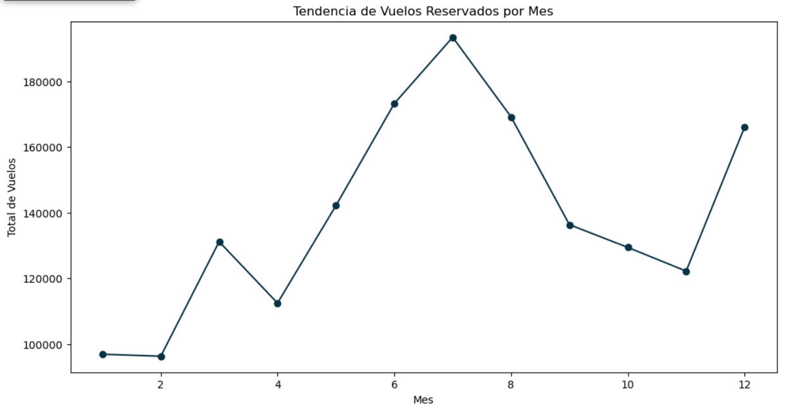

# Léeme:
## /English below/ 👇🏽

¡Hola, Adalaber! Lee atentamente qué encontrarás en este repositorio.

## Contenido del respositorio: 
Aquí encontrarás los archivos de la evaluación de Micaela Lafratta del Módulo 3: Transformando datos.

## Archivos:
Encontrarás:
- "modulo-3-evaluacion-final-1-EDA-limpieza-micaelalafratta.ipynb". Archivo primera parte de la evaluación final. 
- "modulo-3-evaluacion-final-2-visualizacion-estadistica-micaelalafratta.ipynb". Archivo segunda parte de la evaluación final. 
- "modulo-3-documentacion-micaelalafratta.md". Documentación del EDA y limpiezade los datos. En él encontrarás información útil para entender el archivo principal 1.
- Archivos de soporte .py dentro de la carpeta "src". 
- ".gitignore", ya que los CSV con los que se trabaja son muy grandes para subirlos al repositorio. 


## Estructura del ejercicio final:

El ejercicio, que evalúa la comprensión y habilidades en relación a la transformación de datos, consiste en  realizar el EDA, limpieza, visualización y análisis de los datos relativos al comportamiento de los clientes dentro de un programa de lealtad de una aerolínea. 

## Ejemplos de qué encontrarás dentro del ejercicio:

- Uso de diferentes librerías de Pandas para explorar, limpiar y visualizar los datos. 
- Uso de algunas funciones para agilizar la exploración.
- Uso de archivos de soporte. 

### Por ejemplo:
```
reference_levels = ['Bachelor', 'High School or Below']

mean_reference_salary = df_merged.loc[
    df_merged['Education'].isin(reference_levels), 
    'Salary'
].mean()

print(f"Media de Salarios de Referencia Calculada: {mean_reference_salary:,.2f}")
```

```
sp_corr.matriz_correlacion_visual(df_customer_clean)
```
```
plt.figure(figsize=(12, 6))

(
    df_customer_clean.groupby('Month')['Flights Booked'] 
    .sum()                                      
    .plot(kind='line', marker='o', color=pal.ocean_blue_serenity["Azul_Profundo"]) 
)

plt.title('Tendencia de Vuelos Reservados por Mes')
plt.ylabel('Total de Vuelos')
plt.xlabel('Mes')
plt.show()
```




## Ayuda:
- Recuerda que debes disponer de los CSV para poder ejecutar el código. 
- En la primera exploración del EDA, se trabaja sobre dos CSV en bruto y por separado. Después se trabajo sobre un CSV único y limpio. 

---------


# Read me:

Hello, Adalaber! Please read carefully what you will find in this repository.

## Repository contents: 
Here you will find Micaela Lafratta's assessment files for Module 3: Transforming data.

## Files:
You will find:
- ‘modulo-3-evaluacion-final-1-EDA-limpieza-micaelalafratta.ipynb’. File for the first part of the final assessment.
- ‘modulo-3-evaluacion-final-2-visualizacion-estadistica-micaelalafratta.ipynb’. File for the second part of the final assessment. 
- ‘modulo-3-documentacion-micaelalafratta.md’. Documentation of the EDA and data cleaning. Here you will find useful information for understanding the main file 1.
- Support files .py inside the ‘src’ folder. 
- ‘.gitignore’, as the CSV files used are too large to upload to the repository. 


## Structure of the final exercise:

The exercise, which assesses understanding and skills in relation to data transformation, consists of  performing EDA, cleaning, visualising and analysing data relating to customer behaviour within an airline loyalty programme. 

## Examples of what you will find in the exercise:

- Use of different Pandas libraries to explore, clean and visualise the data. 
- Use of some functions to streamline exploration.
- Use of support files. 

### For example:
```
reference_levels = [“Bachelor”, “High School or Below”]

mean_reference_salary = df_merged.loc[
    df_merged[“Education”].isin(reference_levels), 
    “Salary”
].mean()

print(f‘Calculated Average Reference Salary: {mean_reference_salary:,.2f}’)
```

```
sp_corr.visual_correlation_matrix(df_customer_clean)
```
```
plt.figure(figsize=(12, 6))

(
    df_customer_clean.groupby(“Month”)[“Flights Booked”] 
    .sum()                                      
    .plot(kind=“line”, marker=“o”, colour=pal.ocean_blue_serenity[‘Deep_Blue’]) 
)

plt.title(“Trend in Flights Booked per Month”)
plt.ylabel(“Total Flights”)
plt.xlabel(“Month”)
plt.show()
```


## Help:
- Remember that you must have the CSV files in order to run the code. 
- In the first EDA exploration, we work on two raw CSV files separately. Then we work on a single, clean CSV file. 


